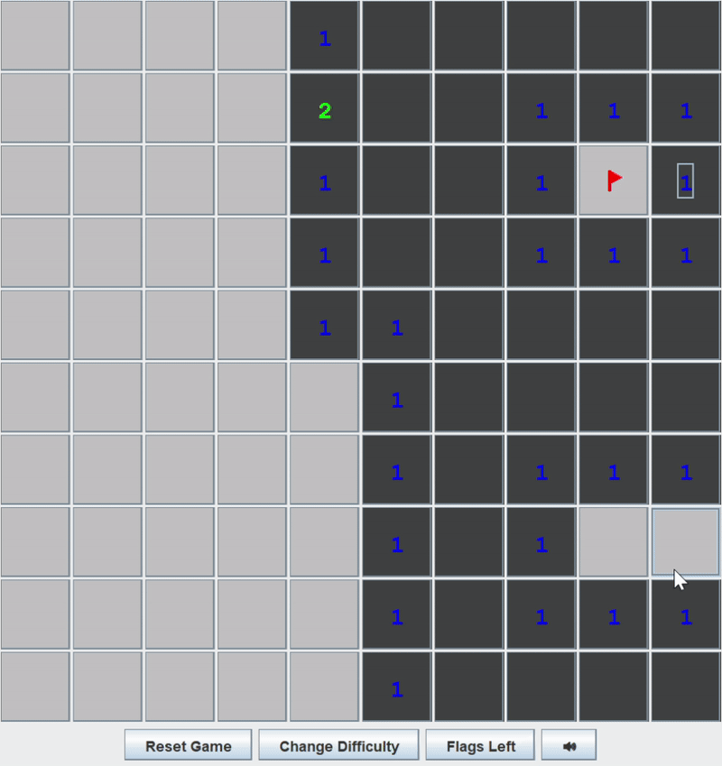

# Minesweeper
Minesweeper is a logic puzzle game where mines are hidden in a grid of squares. Safe squares show numbers of mines in neighbouring cells. The goal is to clear the minefield by clicking safe squares and flagging the mines.

## How to run the game
1. Download ZIP file or clone repository in CLI
2. Run in VS Code (recommended)

## How to play
1. Click on the highlighted tile (in yellow) to start
2. Deduce where mines might be based on numbers revealed and open safe squares
3. Repeat Steps 1-2 until all tiles are open

## Features
- Music: turn on/off during gameplay
- Difficulty levels
    - Easy (10 x 10, 10 mines)
    - Medium (16 x 16, 40 mines)
    - Hard (16 x 30, 99 mines)

## Skills
- Java, Swing

## Folder Structure

The workspace contains two folders by default, where:

- `src`: the folder to maintain sources
- `lib`: the folder to maintain dependencies

Meanwhile, the compiled output files will be generated in the `bin` folder by default.

> If you want to customize the folder structure, open `.vscode/settings.json` and update the related settings there.

## Dependencies
- JDK

## Dependency Management

The `JAVA PROJECTS` view allows you to manage your dependencies. More details can be found [here](https://github.com/microsoft/vscode-java-dependency#manage-dependencies).

## What the game looks like
